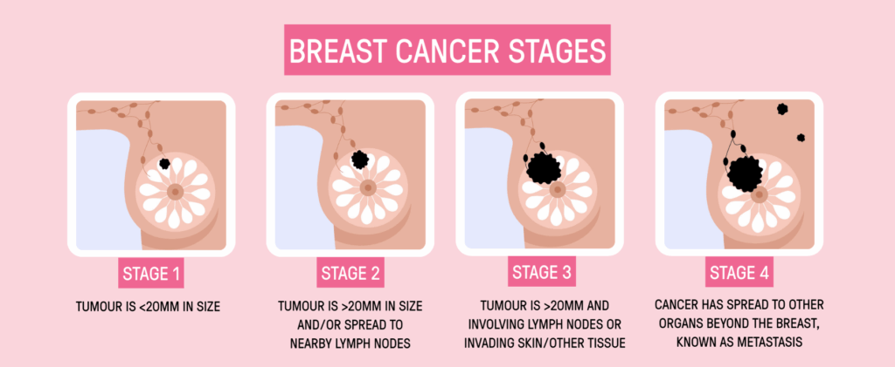
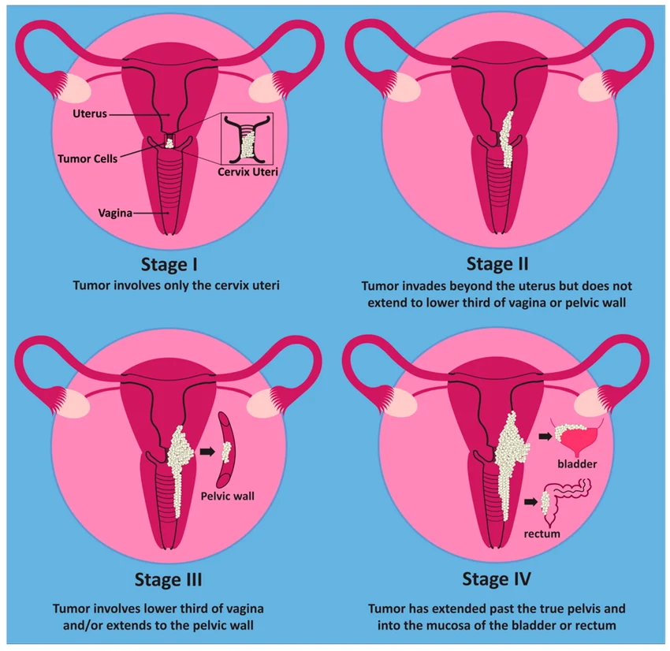

# Breast Cancer [🔗](https://www.nationalbreastcancer.org/what-is-breast-cancer/#:~:text=Breast%20cancer%20is%20a%20disease%20in%20which,the%20causes%2C%20facts%2C%20risk%20factors%2C%20and%20more.)

Breast cancer occurs when abnormal cells grow uncontrollably in breast tissue. It is the most commonly diagnosed cancer among women in the United States and the second leading cause of cancer-related death. Early detection through routine mammograms significantly improves survival rates.

Some key risk factors include:

-   Increasing age

-   Family history and genetic mutations (such as **BRCA1 and BRCA2**)

-   Obesity

-   Alcohol use

-   Physical inactivity

-   Diet

While about **5–10% of breast cancers are hereditary**, most cases occur in individuals without a known genetic mutation.

Like cervical cancer, breast cancer progresses through stages:

-   **Stage 0–1:** Cancer is localized within the breast

-   **Stage 2–3:** Tumors grow and may spread to nearby lymph nodes

-   **Stage 4:** Cancer spreads (metastasizes) to distant organs such as the bones, liver, lungs, or brain

**Early detection is critical.** Routine mammograms can identify breast cancer before symptoms appear, when it is most treatable and survival rates are highest.

**Why this matters:**\
Although breast cancer is common, outcomes are significantly better when it is detected early. Delays in screening and diagnosis can lead to more advanced disease and poorer survival.

# Cervical Cancer [🔗](https://www.cancer.gov/types/cervical/screening)

Cervical cancer develops from abnormal cells in the cervix, often caused by persistent infection with high-risk types of human papillomavirus (HPV). It progresses slowly, which makes regular screening critical for early detection. 

Cervical cancer is one of the most preventable cancers, yet it continues to cause preventable deaths due to gaps in screening and vaccination.

Cervical cancer progresses through stages:

-   **Stage 1:** Cancer is limited to the cervix

-   **Stage 2:** Cancer spreads beyond the cervix but not to the pelvic wall

-   **Stage 3:** Cancer extends to the pelvic wall or lower vagina

-   **Stage 4:** Cancer spreads to other parts of the body

Because this progression is gradual, **routine screening (Pap tests and HPV testing)** can detect abnormal cells before they become cancerous. This makes cervical cancer one of the most preventable cancers.

Most cases of cervical cancer are caused by **persistent infection with high-risk types of human papillomavirus (HPV)**, a common sexually transmitted infection. With HPV vaccination and regular screening, the risk of developing cervical cancer can be significantly reduced.

**Why this matters:**\
When detected early, cervical cancer is highly treatable. However, lack of screening and awareness can lead to late-stage diagnosis, which is more difficult to treat and has worse outcomes.

# 

### **Key Takeaway**

Both breast and cervical cancers:

-   Have **clear screening methods**

-   Are **highly treatable when detected early**

-   Yet still cause preventable deaths due to gaps in access, awareness, and timely care
