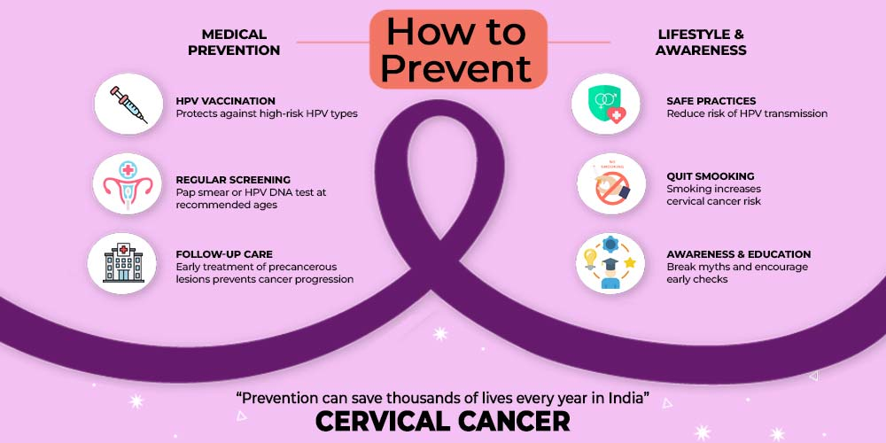
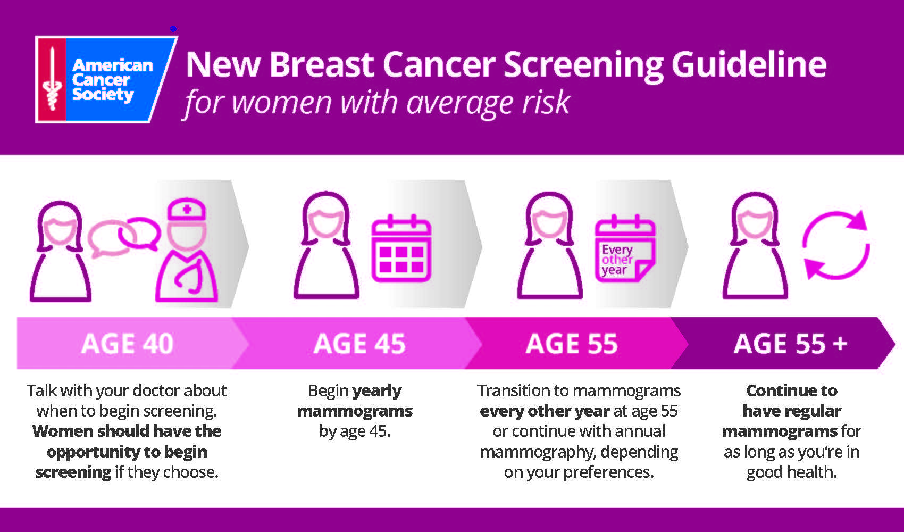

### [**Prevention**]{.underline}

**HPV Vaccination**

-   Protects against high-risk HPV types responsible for most cervical cancers

-   Recommended to begin vaccination at ages 11–12

-   HPV causes over **90% of cervical cancers**

    -   There are over 200 strains of HPV, yet the following are the most high risk

        -   12 high-risk HPV types: HPV **16, 18,** 31, 33, 35, 39, 45, 51, 52, 56, 58, and 59

            -   HPV Strains 16 and 18 are responsible for the most HPV related cancers

**Lifestyle Factors (Breast Cancer)**

-   Maintain a healthy weight

-   Limit alcohol intake

-   Stay physically active

-   Breastfeeding (when possible) may reduce risk

### [**Screening**]{.underline}

**Mammography (Breast Cancer)**

-   Recommended starting around age 40 (varies by guideline)

-   Detects cancer early before symptoms appear

-   Early-stage detection = significantly higher survival

**Cervical Cancer Screening**

-   Pap tests and HPV testing

-   Recommended for women ages 21–65

-   Detects abnormal cells before they become cancer
